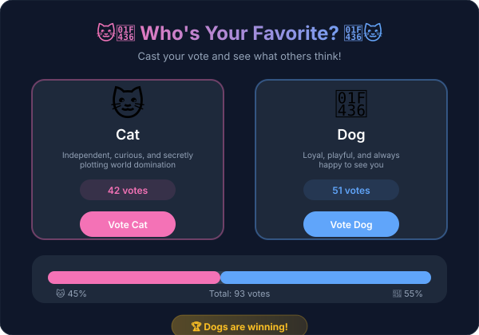

<div align="center">

# 🐱🐶 Cat vs Dog Vote

### *The Ultimate Pet Popularity Battle*


---

**A sleek, modern full-stack voting application where cat lovers and dog lovers can battle it out to prove which pet reigns supreme!**

[Features](#-features) • [Quick Start](#-quick-start) • [Docker](#-docker-deployment) • [API](#-api-reference) • [Contributing](#-contributing)

---

</div>

## ✨ Features

| Feature | Description |
|---------|-------------|
| 🗳️ **Real-time Voting** | Cast votes and see live updates |
| 📊 **Live Results** | Auto-refreshing results page (every 5 seconds) |
| 🎨 **Beautiful UI** | Dark theme with smooth animations |
| 🔒 **Secure API** | Rate limiting, CORS, and Helmet security |
| 🐳 **Docker Ready** | Complete containerization with docker-compose |
| 📱 **Responsive** | Works perfectly on all devices |

---

## 🚀 Quick Start

### Prerequisites

- [Node.js](https://nodejs.org/) 18+ 
- [MongoDB](https://www.mongodb.com/) (local or cloud)
- [Docker](https://www.docker.com/) (optional)

### Installation

1. **Clone the repository**
   ```bash
   git clone https://github.com/your-username/cat-dog-vote.git
   cd cat-dog-vote
   ```

2. **Install dependencies**
   ```bash
   npm install
   ```

3. **Configure environment**
   ```bash
   cp .env.example .env
   # Edit .env with your settings
   ```

4. **Start development server**
   ```bash
   npm run dev
   ```

5. **Open your browser**
   - Frontend: [http://localhost:5173](http://localhost:5173)
   - API: [http://localhost:5000](http://localhost:5000)

---

## 🐳 Docker Deployment

### Using Docker Compose (Recommended)

```bash
# Build and start all containers
docker-compose up -d

# View logs
docker-compose logs -f

# Stop all containers
docker-compose down
```

### Services

| Service | Port | Description |
|---------|------|-------------|
| `frontend` | 3000 | Vue.js application |
| `backend` | 5002 | Express API server |
| `mongo` | 27019 | MongoDB database |

### Building Individual Images

```bash
# Frontend
docker build -f Dockerfile.frontend -t cat-dog-frontend .

# Backend
docker build -f Dockerfile.backend -t cat-dog-backend .

# Database
docker build -f Dockerfile.database -t cat-dog-database .
```

---

## 📡 API Reference

### Endpoints

| Method | Endpoint | Description | Body |
|--------|----------|-------------|------|
| `GET` | `/api/votes` | Get current vote counts | - |
| `POST` | `/api/votes` | Cast a vote | `{ "choice": "cat" \| "dog" }` |
| `DELETE` | `/api/votes` | Reset all votes | - |
| `GET` | `/api/health` | Health check | - |

### Examples

#### Get Votes
```bash
curl http://localhost:5000/api/votes
```

#### Cast Vote
```bash
curl -X POST http://localhost:5000/api/votes \
  -H "Content-Type: application/json" \
  -d '{"choice": "cat"}'
```

#### Reset Votes (Requires Secret)
```bash
curl -X DELETE http://localhost:5000/api/votes \
  -H "x-delete-secret: your-secret-key"
```

---

## ⚙️ Environment Variables

| Variable | Description | Default |
|----------|-------------|---------|
| `PORT` | Server port | `5000` |
| `MONGODB_URI` | MongoDB connection string | `mongodb://localhost:27017/cat-dog-vote` |
| `DELETE_SECRET` | Secret for vote reset | *required* |
| `CORS_ORIGIN` | Allowed frontend origin | `http://localhost:5173` |

---

## 🏗️ Tech Stack

```
┌─────────────────────────────────────────────────────┐
│                      FRONTEND                       │
├─────────────────────────────────────────────────────┤
│  Vue 3 • Vite • Pinia • Vue Router • Tailwind CSS   │
└─────────────────────────────────────────────────────┘
                          │
                          ▼
┌─────────────────────────────────────────────────────┐
│                      BACKEND                        │
├─────────────────────────────────────────────────────┤
│     Express 5 • Mongoose • Helmet • Rate Limit      │
└─────────────────────────────────────────────────────┘
                          │
                          ▼
┌─────────────────────────────────────────────────────┐
│                      DATABASE                       │
├─────────────────────────────────────────────────────┤
│                      MongoDB 7                      │
└─────────────────────────────────────────────────────┘
```

---

## 📁 Project Structure

```
cat-dog-vote/
├── 📁 public/              # Static assets
├── 📁 server/              # Express backend
│   ├── 📁 routes/          # API routes
│   └── 📄 index.js         # Server entry point
├── 📁 src/                 # Vue.js frontend
│   ├── 📁 components/      # Reusable components
│   ├── 📁 pages/           # Page components
│   ├── 📁 stores/          # Pinia stores
│   └── 📁 router/          # Vue Router config
├── 📁 db/                  # Database initialization
├── 🐳 Dockerfile.*         # Docker configurations
├── 🐳 docker-compose.yml   # Docker Compose setup
├── 🐳 Dockerfile.frontend  # Frontend Dockerfile
├── 🐳 Dockerfile.backend   # Backend Dockerfile
├── 🐳 Dockerfile.database  # Database Dockerfile
└── 📦 package.json         # Dependencies
```

## 🎨 Screenshots

### Vote Page

<p align="center">
  
</p>

---

## 🤝 Contributing

Contributions are welcome! Please follow these steps:

1. **Fork** the repository
2. **Create** a feature branch (`git checkout -b feature/amazing`)
3. **Commit** your changes (`git commit -m 'Add amazing feature'`)
4. **Push** to the branch (`git push origin feature/amazing`)
5. **Open** a Pull Request

---

## 📄 License

This project is licensed under the MIT License - see the [LICENSE](LICENSE) file for details.

---

<div align="center">

### Made with ❤️ for pet lovers everywhere

🐱 **Cat Squad** vs 🐶 **Dog Gang** — *Who will win?*

**[Cast Your Vote Now!](http://localhost:3000)**

---


</div>
